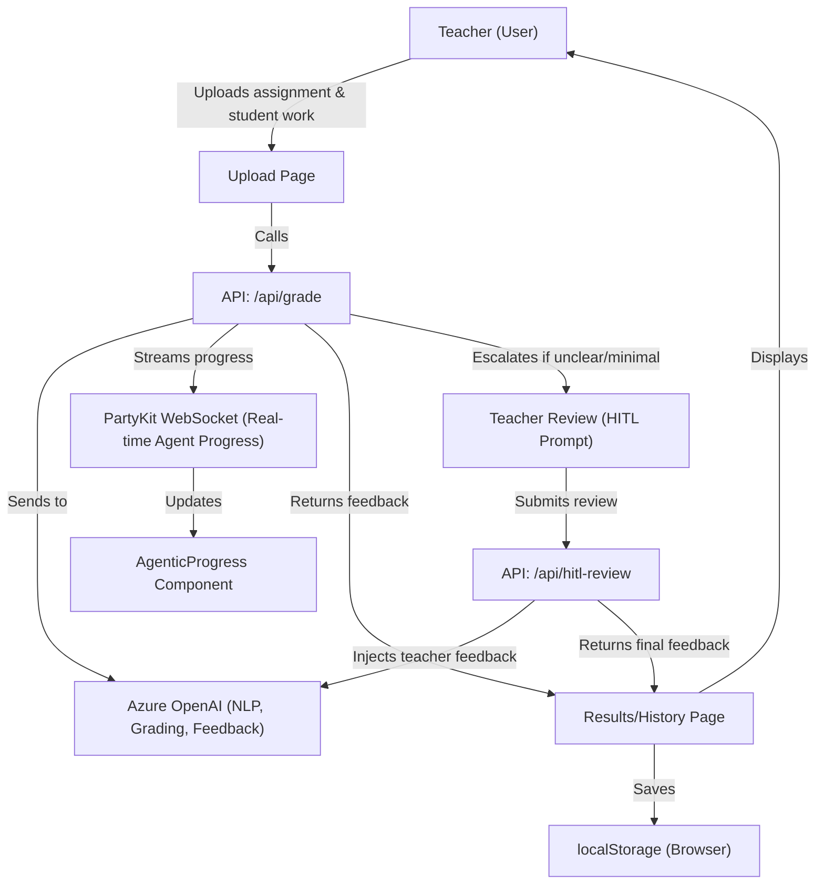

### Project Name

AutomatedAssessmentFeedbackAgent

### Description

# AI-Powered Automated Assessment and Feedback Agent


> An intelligent, agentic AI system built by a teacher-turned-engineer to deliver instant grading, personalized feedback, and real-time transparent reasoning - saving teachers hours and improving student outcomes.

---

## 🏆 Hackathon Info

Built for the [Microsoft Hack Together: AI Agents Hackathon](https://microsoft.github.io/AI_Agents_Hackathon/) (April 8–30, 2025).  
Status: Hackathon prototype/MVP.  
See the [Official Rules](https://microsoft.github.io/AI_Agents_Hackathon/rules/).

Created using:

- JavaScript/TypeScript
- Azure AI Agent Service

---

## 📽️ Demonstration and Hackathon Experience Video

[Watch it on YouTube](https://www.youtube.com/watch?v=FAi9-s9WP84)

---

## ✨ Live Demos / Key Functionality

**Key Features:**

- Instant, AI-powered grading and feedback
- Human-in-the-Loop escalation for ambiguous cases
- Real-time agentic tool use and transparent reasoning
- Assessment history stored locally for privacy
- Fully tested and CI-backed for reliability

Below are GIF demonstrations of the Automated Assessment Feedback Agent in action, showcasing core features and real-world scenarios:

### 1. Human-in-the-Loop (HITL): Wrong Assignment Provided

_The agent detects when a student submits the wrong assignment and facilitates teacher intervention._


### 2. HITL: English as an Additional Language (EAL) Student

_Demonstrates tailored feedback and HITL support for a student with EAL needs._


### 3. Assessing a Wordy Essay-Type Task

_Shows the agent analyzing and providing feedback on a complex, open-ended essay response._


### 4. Assessing a Computer Science Coding Task

_The agent evaluates a programming submission, running code tests and generating feedback._


---

## 📁 Table of Contents

1. [Project Overview](#1-project-overview)
2. [Team Information](#2-team-information)
3. [What Makes This Unique](#3-what-makes-this-unique)
4. [Who Is This For?](#4-who-is-this-for)
5. [How It Works](#5-how-it-works)
6. [Technical Details](#6-technical-details)
7. [Automated Testing & Quality Assurance](#7-automated-testing--quality-assurance)
8. [Human-in-the-Loop Innovation](#8-human-in-the-loop-innovation)
9. [Accessibility and Responsible AI](#9-accessibility-and-responsible-ai)
10. [Security & Privacy](#10-security--privacy)
11. [Setup, Usage, and Testing](#11-setup-usage-and-testing)
12. [License](#12-license)

---

## 1. Project Overview

### Elevator Pitch

An agentic AI system for teachers that transforms grading and feedback.  
Transparent, real-time tool use and reasoning builds trust—giving educators instant, individualized assessments and actionable feedback for students that teachers can understand, edit, and trust.

---

## 2. Team Information

Created and built entirely by me, **Josh Creek** - an ex-teacher and current software engineer.  
Mission: build AI tools that **genuinely empower educators**, **save time**, and **improve student outcomes**.

---

## 3. What Makes This Unique

_Why is this different from other AI grading tools?_

- **Real-Time Transparency:** Teachers see every reasoning step and tool the agent chooses—live.
- **Personalized Feedback:** Detailed, contextual feedback plus strengths, improvements, follow-on activities, and suggestions.
- **Human-in-the-Loop Escalation:** The agent escalates edge cases to the teacher for review (never guessing blindly).
- **Resilient History Management:** All assessments stored locally for review, even during demos (no student data stored anywhere but the teacher's browser).
- **Accessibility First:** Full screen reader support, keyboard navigation, color contrast compliance.
- **Robust Error Handling:** Friendly, actionable error messages for upload, AI, or network issues.
- **Real-Time Agentic Progress Visualization:** Not just a loading spinner—teachers see, in real time, which tools and reasoning steps the agent chooses as it grades. This transparency builds trust and helps educators understand _how_ AI arrives at its conclusions.
- **Built by a Teacher, for Teachers:** Practical, realistic, classroom-aware design.

---

## 4. Who Is This For?

### Audience

- **Teachers** seeking to save time, improve feedback quality, and maintain control.
- **Schools/Educational Institutions** aiming to modernize and streamline assessment workflows.

### Educational Impact

- Reduces hours spent grading and marking.
- Improves quality and consistency of student feedback.
- Allows teachers more time to focus on direct student interaction and lesson planning.

---

## 5. How It Works

### Workflow At A Glance

1. Upload assignment instructions and student response (text for demo; file support planned).
2. Agent generates real-time, transparent reasoning and instant grading.
3. If the agent thinks it needs it, it can optionally ask the teacher for suppport (Human-In-The-Loop).
4. Teacher reviews, edits, or clears assessments from local history.

### Demo it!

> Upload a meaningful text (or minimal/off-topic text to trigger Human-in-the-Loop escalation).  
> Watch live tool use and reasoning.  
> Review or clear past assessments directly in history.

### System Flow Diagram (with HITL)

This shows how a user interacts with the system and how requests are processed, including HITL.



### Architecture Diagram

This shows the big-picture technical structure and how my chosen technologies fit together.

The architecture includes:

- Frontend: SvelteKit app (browser)
  - Connects to PartyKit (for real-time events)
  - Calls API endpoints (/api/grade, /api/hitl-review)
  - Saves assessment history in browser localStorage
- Backend: SvelteKit API routes (serverless functions, e.g., Netlify)
  - /api/grade: Handles grading, talks to Azure OpenAI
  - /api/hitl-review: Handles teacher review, resumes AI grading
- Third-Party Services:
  - Azure OpenAI (AI grading, feedback)
  - Azure AI Agent Service (agentic workflow orchestration, tool use, LLM integration)
  - PartyKit (WebSocket server for real-time updates)
- Data Storage: Only in browser (localStorage), no backend DB

System architecture diagram showing component hosting, communication flows (HTTP, WebSocket), and external AI service integrations:


---

## 6. Technical Details

- **Frontend:** [SvelteKit](https://kit.svelte.dev/) + [TypeScript](https://www.typescriptlang.org/)
- **Real-time Events:** [PartyKit](https://partykit.io/)
- **AI & Agent Orchestration:** [Azure AI Agent Service](https://azure.microsoft.com/en-us/products/ai-services/ai-agent-service) (agentic workflows, tool use) + [Azure OpenAI](https://azure.microsoft.com/en-us/products/ai-services/openai-service) (LLMs)

---

## 7. Automated Testing & Quality Assurance

This project is built with a strong focus on reliability and correctness:

- **Comprehensive BDD Tests:** All core features are covered by automated, scenario-based tests using [Cucumber](https://cucumber.io/) and [Playwright](https://playwright.dev/).
- **Continuous Integration:** Every commit to the `main` branch triggers a full test suite via GitHub Actions ([see badge above](#ai-powered-automated-assessment-and-feedback-agent)), ensuring nothing breaks unexpectedly.
- **Real-World Scenarios:** Tests simulate real teacher/student interactions.
- **Easy to Run:**
  ```bash
  pnpm run test:bdd
  ```
  Or view the [test scripts](./tests/bdd).

**Result:** You can trust that this agent works—every time.

---

## 8. Human-in-the-Loop Innovation

### How It Works

- If a student submission is minimal/ambiguous, the agent returns `HUMAN_REVIEW_REQUIRED` and explains why.
- Teacher intervenes, providing direct feedback.
- Agent resumes, using the human input to complete grading and feedback generation.

### Why It Matters

- **Transparency:** Teachers always see _why_ the agent requests help, with clear reasoning.
- **Control:** Teachers remain in the loop for edge cases, ensuring fairness and pedagogical soundness.
- **Innovation:** This collaborative workflow demonstrates how agentic AI can augment, not replace, expert educators—addressing a key hackathon challenge.

---

## 9. Accessibility and Responsible AI

### Accessibility

- Screen reader and keyboard friendly.
- Color contrast meets WCAG AA standards.
- Accessible real-time agent progress updates.
- Tested with browser accessibility tools.

### Responsible AI

I am committed to responsible and ethical use of AI in education. This project:

- Uses Azure OpenAI and Cognitive Services, which comply with Microsoft's responsible AI principles.
- Does not retain or share student data beyond local processing in the browser (history is stored in localStorage only).
- Clearly communicates to users when they are interacting with AI-generated feedback.
- Is designed to minimize bias by providing transparent, explainable feedback and allowing teachers to review/edit results.
- Does not use student data for model training or any secondary purpose.

---

## 10. Security & Privacy

- **No Persistent Storage:** All assessment history and student data are stored only in the user’s browser (localStorage). Nothing is ever uploaded to or retained on any backend server or database.
- **Ephemeral AI Agent Threads:** AI agent threads and any temporary data created during assessment are deleted immediately after grading is complete.
- **No Data Sharing:** Student data is never shared with third parties, used for model training, or processed for any purpose other than providing instant feedback.
- **User Control:** Users can review and clear their assessment history at any time from within the app.
- **Secure Communication:** All interactions with the Azure AI Agent Service are performed over secure, encrypted channels (HTTPS/WSS).
- **Privacy by Design:** The system is architected to maximize privacy and minimize data exposure at every step.

---

## 11. Setup, Usage, and Testing

### Prerequisites

- [Node.js](https://nodejs.org/) (v23 or newer recommended)
- [pnpm](https://pnpm.io/installation)

### Running Locally

Once you've installed dependencies with `pnpm install`, start a development server:

```bash
pnpm run dev
# or start the server and open the app in a new browser tab
pnpm run dev -- --open
```

#### Building

To create a production version:

```bash
pnpm run build
```

You can preview the production build with `npm run preview`.

### PartyKit Setup for Real-Time Events

This project includes end-to-end BDD (Behavior-Driven Development) tests using [Cucumber.js](https://github.com/cucumber/cucumber-js) and [Playwright](https://playwright.dev/).

#### Prerequisites

- All application dependencies installed (see above)
- [Node.js](https://nodejs.org/) and [pnpm](https://pnpm.io/)

#### Install Playwright Browsers

If you haven't already, install Playwright's required browsers:

```bash
pnpm exec playwright install
```

#### Running the Tests

1. Start the SvelteKit dev server:
   ```bash
   pnpm run dev
   ```
   (Or use `pnpm run bdd:full` to auto-start the server and run tests.)
2. In a separate terminal, run the BDD tests:
   ```bash
   pnpm run test:bdd
   ```
   This will execute all feature files in `tests/bdd/features/` using step definitions in `tests/bdd/steps/`.

#### Test Output & Screenshots

- Test results will be shown in the terminal.
- On failure, a screenshot will be saved to the `screenshots/` directory in the project root (see `tests/bdd/support/hooks.ts`).
- Screenshot filenames are based on the scenario name.

#### Customizing/Debugging

- You can run a specific feature file:
  ```bash
  pnpm run test:bdd -- tests/bdd/features/assessment_submission.feature
  ```
- For more verbose output, add `--format progress` or `--format summary`.

#### Project Scripts

- `pnpm run test:bdd` – Run all BDD tests
- `pnpm run bdd:full` – Start dev server and run all BDD tests (requires [start-server-and-test](https://github.com/jsdom/start-server-and-test))

For more information, see the `package.json` scripts section.

---

## 12. License

Licensed under the Business Source License 1.1.  
See LICENSE file for details.

---

## 13. Future Enhancements

- Integration with major Learning Management Systems (LMS) for streamlined workflow.
- Expansion of supported assignment types and subjects.
- Development of analytics dashboards for deeper insights into class performance.
- Image upload for handwritten work, especially for teachers of younger students.

---

**Built with love for teachers.**


### Language & Framework

- [ ] Python
- [ ] C#
- [ ] Java
- [x] JavaScript/TypeScript
- [ ] Microsoft Copilot Studio
- [ ] Microsoft 365 Agents SDK
- [x] Azure AI Agent Service

### Project Repository URL

https://github.com/jcreek/AutomatedAssessmentFeedbackAgent

### Deployed Endpoint URL

_No response_

### Project Video

https://www.youtube.com/watch?v=FAi9-s9WP84

### Team Members

jcreek

### Registration Check

- [x] Each of my team members has filled out the registration form
